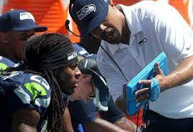
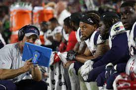
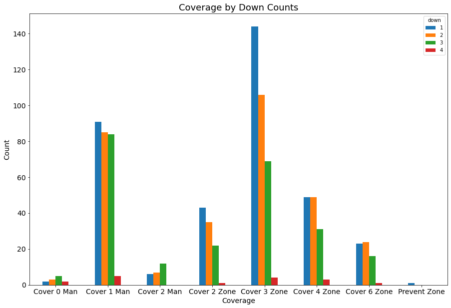
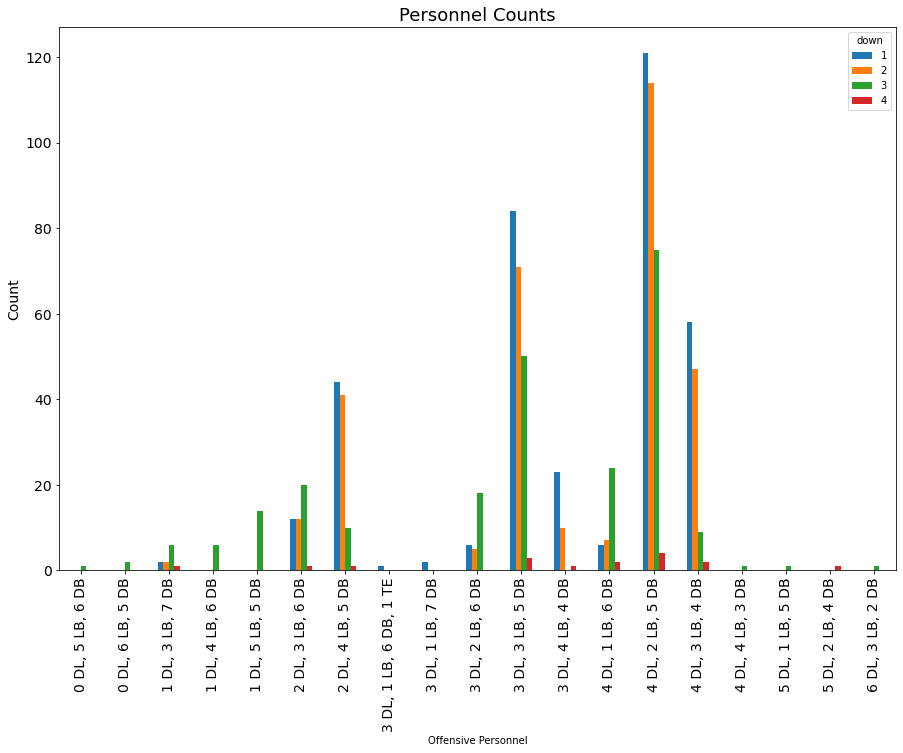

# Pigskin Play Caller
Author: David Shin


## The Business Problem

Analytics and data in sports continues to grow every year. In decades prior, Football teams and coaches relied on anecdotal decisions and the athletic abilities of their players to swing the outcome of the game. However, in recent years, more and more data has been collected in order to improve decision making and training. On the sidelines, we see tablets and Ipads in coaches' hands. From up above, we see additional strategists probing the field and court for any observations that will contribute to winning. 




Because of the way football is formatted, it allows teams to take time between plays to make adjustments and calculations. Currently, there aren't many ways to quickly make analytical decisions.  In conjunction with data science, football teams can utilize models to make these on the fly decisions and adjustments based off the situation on the field. The situation includes factors such as on field players, positioning of those players, game situation (current down, yards left to first down), weather, and stadium setting. All these factors have an impact on the success of a play and can be used to make ideal decisions.

This project aims to create a model that will capture any observations on the field including game situations and offense, that will help to make a better decision on defensive side of the ball. The model looks at the positioning of the players on offense on the field and the different types personnel on the field (WR/TE/RB). Teams employ different offensive personnel breakdowns (WR/TE/RB). These positions will be explained in more detail later. The model also looks at the game situation of the down situation and the yards needed for a first down. The goal of this model is to address the issue of making decisions analytically and quickly by calculating the EPA of the next play and recommending the coverage that predicts the lowest EPA. EPA is short for Expected Points Added, which will be the target variable for our model.


## Data

The first piece of data comes from a Kaggle dataset from the NFL. The data provides play-by-play data from Week 1-Week 17 of the 2018 NFL season. The data provides positioning of the offense and the number of players by position on the field. The data provides specific numbers of players on offense in which position (WR/TE/RB) and also the number of personnel on defense (DB/LB/DL). 

### Target Variable

Our target variable in this dataset is going to be EPA, or Expected Points Added. Expected Points Added is calculated by contrasting the situation of the play (Down/Distance/Field Position) at the start of play and the end of the play. The metric looks to calculate how much each play contributes to the score. This is necessary because in Football, a 10 yard gain on first down from my own 10 yard line is different from a 5 yard gain on the opponent 10 yard line on 3rd and 1. This metrics allows us to evaluate the impact of each play to the overall result of the game. 

https://www.kaggle.com/c/nfl-big-data-bowl-2021/data

The second piece of data comes from Telemetry sports. Telemetry sports was able to look into Week 1 of the 2018 NFL season and provide coverages used by each team. Coverages are the scheme utilized by the defense guarding the deeper/passing portion fo the field. 

https://www.kaggle.com/tombliss/additional-data-coverage-schemes-for-week-1

The last piece of data was provided by Football Outsiders. This provides ranks for each team in terms of offensive/defensive output from the 2018 season. The teams have ranks for their offense and additionally I will look into using strength by position from this dataset.

https://github.com/guga31bb/nflfastR-data/tree/master/data

## Glossary

QB - Quarterback

WR - Wide Receiver

RB - Runningback

LB - Linebacker

DB - Defensive Back

DL - Defensive Lineman

Down - Another word for a play. Teams are given four downs to either score or gain an additional 10 yards. Once 10 yards are gained, the downs start over at four. If 10 yards are not gained or points are not scored, the opposing team gets the possession of the football.

EPA - Expected Points Added

Coverage - Scheme employed by the defense in regards to the field positioning of the players in the deeper regions of the field

Personnel - Assortment of players employed by the offense or defense. These can be different depending on the situation on the field


## EDA

We see from our EDA that the most commonly utilized coverage scheme is the Cover 3 Zone. This is one of the most popular formations in football and also one of the most basic coverages in football. It's commonly used because In years prior, people thought it was elementary and used mainly for high school football, however, the Seattle Seahawks popularized this coverage scheme. The coverage is used frequently because it is balanced against both the run and pass offense.


The most utilized personnel on defense is the  4-2-5 or (4 DB, 2 LB, 5 DB) defensive personnel. The biggest strengths of this offense is the versatility of the defensive backs. With 5 backs, the defense is able to apply pressure to the passing game while also stopping the run. In general, the 4-2-5 personnel scheme is best utilized by teams with hybrid ends that are typically more undersized but compensate with speed.


I also wanted to see the EPA by coverage. It was evident that there are slight improvements in EPA when using different coverages. It was important to identify if coverages had an impact on the EPA. There were also other external factors that were looking into more deeply such as EPA with coverages on specific downs and the discrepancies there were larger as noted in my notebook.


I wanted to take a deeper look into the coverages utilized. It becomes pretty evident that depending on the down situation the usage of coverage will differ. As shown below, the standard 1st down situation is most of the time a cover 3, but not all the time. This is supportive of the need for a good model because the yardage situations will differ on 1st down depending on penalties.



However, the most important impression was that the use of personnel also made a big impact on the EPA. It looks like there are clear situations and personnel schemes that can swing the EPA. With the use of our model, we can isolate the situations to when we use which personnel package.


I once again took a deeper look into the personnel breakdown. Although the 4/2/5 defensive scheme is the most utilized, there were other teams that utilized a 3/3/5 on various yardage situations as well. 



## Modeling Process

### Train Test Split

First the data was cleaned to ensure we only review data from prior to the ball snap. I merged the data from the NFL with the data from Telemetry sports. Then, I scaled my data and then, I train-test split our data and ran the below models.

### Models

I trained 6 different machine learning classification models to predict the EPA of a given play. The models I used were the following:

- Logistic Regression
- Gradient Boosting
  - GridSearch
- XGBoost
  - GridSearch
- RandomForest

#### Cross-Validation

Cross validation was run on all our models to find overfitting.

### Linear Regression

I ran a basic linear regression model. After finding the RMSE and MSE. Afterwards, I decided to run various other models to test RMSE and see improved scores. 

### Decision Tree Regression

My second model was the DecisionTreeRegressor Model. After noticing the RMSE was a higher value, I decided to abandon this model and move onto another model.

### Random Forest Regression 
Third model was a RandomForestRegression Model. RMSE was slightly worse than our initial linear regression model. I also ran a GradiestBoosterRegressor model and the RMSE was similar or slightly better than my initial LinearRegression model. Lastly, I tried an XGboost which showed no improvement.

### Gradient Booster Regression

Finally, I ran a GridSearch on my GradiestBoosterRegression model to find the ideal parameters for my model. My GridSearch returned better parameters for my learning rate, max depth, max features, and n estimators for my GradientBooster model. This turned out to be my best performing model along with my initial linearregression.

### GridSearch

Just to see if there was any significant improvement, I ran a GridSearch on my XGRegression model and my GradientboosterModel. Through GridSearch, I was able to marginally improve the performance of my GradiestBoosterModel and it assisted in developing my final model.

## Conclusion

### Best Model 

Our most optimal model was the XGBRegressor model. After GridSearch, we were able to further improve the performance of our model. In comparison to our STDEV and mean, our results came out to about 1.04 and 0.14 respectively. According to our initial looks during EDA, our target variable has somewhat of a normal distribution. Currently, our model shows promise. However due our RMSE covering about 1 standard deviation in error (about 70% of our data), our model will require more tuning before being put into actual practice.  Next steps will require gathering coverage from other weeks of data in order to make our models more accurate. Additional next steps are laid out below.

### Webapp

A simple webapp has also been created. Users can input the variables needed to predict our target variable and a recommendation will be given on coverage scheme to use to counter the offense. These variables that the user needs to input include weather, game setting and offensive player personnel and position. 

### Next Steps

I'd like to look into finding additional data from the NFL on other seasons. Currently, my dataset would only be a predictor for the 2018 season, however if I were to capture data and model with the 2020 dataset, I would potentially be able to predict current games. 

With the increased dataset, I would also want to create a model that is specifically catered to each team. Right now, the model is taking a look at football as a whole however, with more data the model could be tuned to look at specific teams.

Potential injury news could also be used to see if potential players were targetted. Injuries would impact player performance for certain games and could certainly affect stats such as EPA that normally wouldn't.

```
## Navigation
├── images
├── data
├── field.ipynb
└── code.ipynb
```


