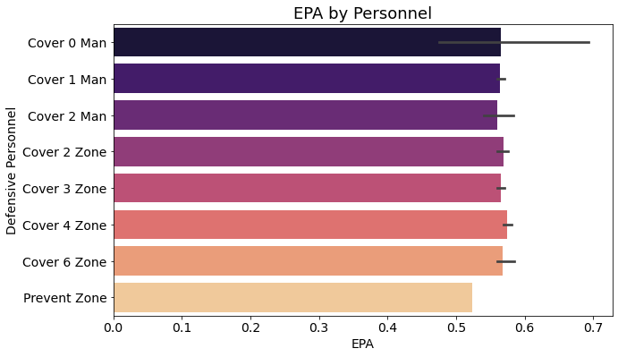

# Pigskin Play Caller
Author: David Shin


## The Business Problem

Analytics and data continues to grow every year. In decades prior, teams and coaches relied on anecdotal decisions and the athletic abilities of their players to swing the outcome of the game. However, in recent years, more and more data has been collected in order to improve decision making and training. On the sidelines, we see tablets and Ipads in coaches hands. From up above, we see additional strategists probing the field and court for any observations that will contribute to winning. 

It has become important that we make decisions with data to back them up. These decisions must be made quickly but carefully. Football teams are now growing their manpower and technology when it comes to data. 

This project aims to create a model that will capture any observations on the field including game situations and offense, that will help to make a better decision on defensive side of the ball. The model looks at the positioning of the players of the offense on the field and the personnel on the field. The model also looks at the game situation of the down situation and the yards needed for a first down. The goal of this model is to address the issue of making decisions analytically and quickly. Teams can quickly confirm or reject their anecdotal decisions with the use of this model. 


## Data

The first piece of data comes from a Kaggle dataset from the NFL. The data provides play-by-play data from Week 1-Week 17 of the 2018 NFL season. The data provides positioning of the offense and the number of players by position on the field. The data provides specific numbers of players on offense in which position (WR/TE/RB) and also the number of personnel on defense (DB/LB/DL). Our target variable in this dataset is going to be EPA, or Expected Points Added. Expected Points Added is calculated by contrasting the situation of the play (Down/Distance/Field Position) at the start of play and the end of the play. This is necessary because in Football, a 10 yard gain on first down from my own 10 yard line is different from a 5 yard gain on the opponent 10 yard line on 3rd and 1. This metrics allows us to evaluate the impact of each play to the overall result of the game. 

The second piece of data comes from Telemetry sports. Telemetry sports was able to look into Week 1 of the 2018 NFL season and provide coverages used by each team. Coverages are the scheme utilized by the defense guarding the deeper/passing portion fo the field. 

The last piece of data was provided by Football Outsiders. This provides ranks for each team in terms of offensive/defensive output from the 2018 season. The teams have ranks for their offense and additionally I will look into using strength by position from this dataset.

## EDA

We see from our EDA that the most commonly utilized coverage scheme is the Cover 3 Zone. This is one of the most popular formations in football and also one of the most basic coverages in football. It's commonly used because In years prior, people thought it was elementary and used mainly for high school football, however, the Seattle Seahawks popularized this coverage scheme. The coverage is used frequently because it is balanced against both the run and pass offense.


The most utilized personnel on defense is the  4-2-5 or (4 DB, 2 LB, 5 DB) defensive personnel. The biggest strengths of this offense is the versatility of the defensive backs. With 5 backs, the defense is able to apply pressure to the passing game while also stopping the run. In general, the 4-2-5 personnel scheme is best utilized by teams with hybrid ends that are typically more undersized but compensate with speed.


I also wanted to see the EPA by coverage. It was evident that there are slight improvements in EPA when using different coverages. It was important to identify if coverages had an impact on the EPA. There were also other external factors that were looking into more deeply such as EPA with coverages on specific downs and the discrepancies there were larger as noted in my notebook.



However, the most important impression was that the use of personnel also made a big impact on the EPA. 


## Modeling Process

### Train Test Split

First the data was cleaned to ensure we only review data from prior to the ball snap. We merged our data from the NFL with the data from Telemetry sports. Next, I train-test split our data and ran the below models.

### Models

I trained 6 different machine learning classification models to predict whether a given shot would go in. The models I used were the following:

- Logistic Regression
- Gradient Boosting
  - GridSearch
- XGBoost
  - GridSearch
- RandomForest


I ran a basic linear regression model. After finding the RMSE and MSE. Afterwards, I decided to run various other models to test RMSE and see improved scores. 

My second model was the DecisionTreeRegressor Model. After noticing the RMSE was a higher value, I decided to abandon this model and move onto another model.

Third model was a RandomForestRegression Model. RMSE was slightly worse than our initial linear regression model. I also ran a GradiestBoosterRegressor model and the RMSE was similar or slightly better than my initial LinearRegression model. Lastly, I tried an XGboost which showed no improvement.

Finally, I ran a GridSearch on my GradiestBoosterRegression model to find the ideal parameters for my model. My GridSearch returned better parameters for my learning rate, max depth, max features, and n estimators for my GradientBooster model. This turned out to be my best performing model along with my initial linearregression.

Just to see if there was any significant improvement, I ran a GridSearch on my XGRegression model, but this showed very little improvement from my initial model run. 

## Next Steps

I'd like to take into account the weather from the day of the event into account. It's well known that weather factors such as snow/rain/wind can highly impact the decisions made during the game when it comes to deciding between passing and running. 

I'd also like to look into finding additional data from the NFL on other seasons. Currently, my dataset would only be a predictor for the 2018 season, however if I were to capture data and apply my predictor to a 2020 dataset, I would potentially be able to predict current games.

Potential injury news could also be used to see if potential players were targetted. Injuries would impact player performance for certain games and could certainly affect stats such as EPA that normally wouldn't.

I would also like to make a webapp or platform that would make it easier to quickly plug in the dimensions needed to output the recommended defense.


```
## Navigation
├── images
├── data
├── field.ipynb
└── code.ipynb
```

## Credits

Credits to user Robikscube for the Plotting Field/Player Position Chart

